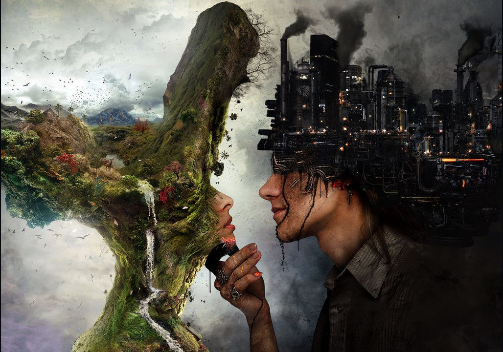
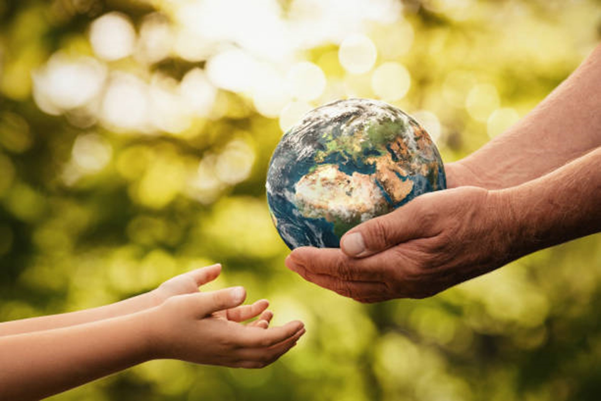
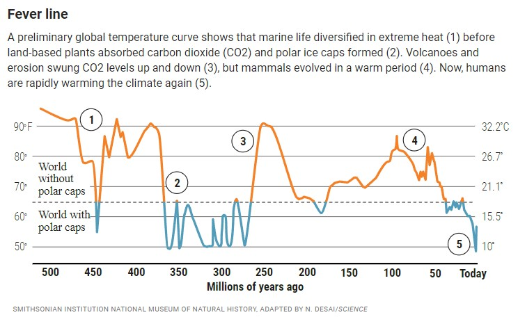
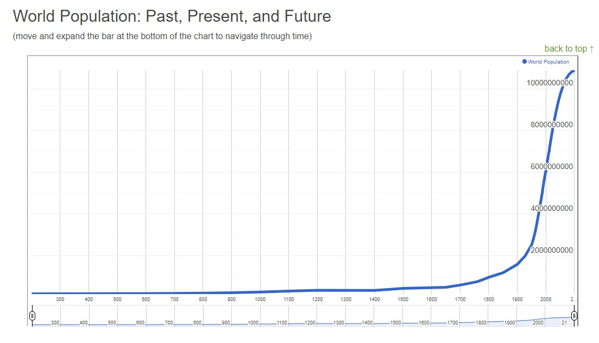

    

Matthew R. Topham

Professor Elizabeth Jackson

Eng 122-500 Composition II

24 Apr. 2022

<h1> The Population Explosion of Mankind: To What Extent Has Man Influenced the World?</h1> 

### Matthew R. Topham

### April 24th, 2022

    

### Audience: Corporate entities and people of the earth who care about the planet and our future as a species.

Man has influenced the world. The countries of the first world have unintentionally changed the natural course of the planet through our industrialized society. The byproduct of our society, carbon dioxide, has changed the natural cycle of the planet. Yet the first world countries are some of the least to feel the impact of their actions. Those who contribute least to the problem of climate change, those in developing countries, are those who feel the greatest impact through the changing environment. We must realize that we are all in this together, there is no us and them, its just us, mankind. With great power comes great responsibility, and as members of the first world, we have a great responsibility as the stewards of planet earth. We must lead by example and pave the way through our actions, in our science, and how we treat one another.

Those who contribute the most to climate change are corporations that transcend individual government jurisdiction and individuals of first world countries, corporations that have grown faster than government jurisdiction can create laws to govern them. These corporations know that they have a responsibility to leave the planet better than they received it, especially since a corporate entity can live longer than a single man, and therefore has a greater responsibility to our future as a species. It is in a corporation’s best interest to preserve the earth for future generations, as the future of mankind depends on a sustainable biosphere, and thus corporate entities have a vested interest in this goal as well, because without man, corporations cannot exist. If we are to reach a population of 11 billion, it is best that we do so in a way that works with nature, and not against it.  Corporations know about their impact on the planet through the scientific community. It is best if one considers how the individual actions of first world citizens and corporations impact the collective of mankind and the rest of the world. 

Mankind values the earth, it’s only home. Mankind knows the earth is a planet with a system of interconnected systems. Influencing one system has cascading affects in other systems, a balance we are currently learning about and how to best maintain. We live in a system of interconnected systems. Small actions in one part of the world can have big implications in other parts of the world, especially when it comes to the environment. The future of planet earth is at stake; what we do in the next 100 years will pave the way for those who come after us. Mankind wants to be remembered as those who preserved the world for those who came after them, as those who passed the torch to the next generation, and not those who threw away the gift given to them.  

Mankind can compete to solve the problem of climate change. The individual can vote with their money by purchasing from climate friendly companies and voluntarily donating to offset their carbon footprint to be net neutral. Corporations can do the same as individuals and challenge one another to be net neutral. It is important to note that corporations have a greater responsibility than the individual as they have a greater impact, so it is especially important that corporations lead by example in their action, science, how they treat one another, and policy. It is in corporations’ best interest to preserve the planet, so that they will still have a healthy population for their products. 

Citizens of planet earth, mankind has grown to a point where collectively we have changed the natural course of our planet. This may have been in our best interest, for if we had not burned fossil fuels, the ice age that we are currently living in may have advanced further and we could have potentially regressed deeper into our current ice age, bringing more destruction to the population through lack of food and crops than warming temperatures. 

Some may say that the solar output of the sun has changed and that is the cause of the changing climate. This is incorrect as the solar output of the sun has remained relatively constant varying only slightly in total solar irradiance over the last 400 years. Solar activity has remained relatively stable since we first began observations in the 1600’s. The chart below provided by NOAA represents solar activity and difference from average global temperature, with solar activity remaining stable and average global temperature variance increasing to up to 1.5 degrees in 2010, showing a break from the previous correlation of average global temperature and solar output, leading to another variable affecting the equation, the possibility that it may be caused by the rise of the industrial man and his influence on the world.

    

It is important to acknowledge that humanity has influenced the planet and that collectively, our decisions and actions make a difference in creating and shaping our world for us and our children to thrive, and for our species to continue. We must leave the world better than we received it, and make improvements, so that our children can continue our work and make the world a place where humanity can flourish as we were meant to. 

Mankind is currently at a population of about eight billion and continuing to increase every day. Over the next hundred years, the population is estimated to grow to about 11 billion. What we do over these next hundred years will influence the world that we live in and the world that we leave our children and pave the way for their success as a species. We cannot change the past, but through our actions in the present, we can change the course of our future. 

Adaptability is important in the years to come, as we must adapt to our changing climate and environment. With great power comes great responsibility, and we must be more responsible as a species in preserving the biodiversity of the natural world. We must keep the biodiversity of our forests and oceans. The corals of the great barrier reef are dying, and our forests are being destroyed. The oceans are being polluted and the atmosphere is overflowing with carbon dioxide. Some may even say that we are currently living through the 6th mass extinction. 

Yet, all is not lost. Mankind is itself a force of nature, a force that can be used for good. We can preserve our oceans and our forests and keep the biodiversity of planet earth flourishing. If the planet and its biodiversity die, then our chances at success as a species are greatly reduced, but it doesn’t need to be so. This world is changing… but we decide into what.

The Anthropocene is the newest geological age defined by man’s introduction of the industrial revolution to our small planet we all call home and will be defined even further by what we do in the years to come.

“Adopting the Anthropocene may reverse this trend by asserting that humans are not passive observers of Earth’s functioning. To a large extent the future of the only place where life is known to exist is being determined by the actions of humans. Yet, the power that humans wield is unlike any other force of nature because it is reflexive and therefore can be used, withdrawn or modified. More widespread recognition that human actions are driving far-reaching changes to the life-supporting infrastructure of Earth may well have increasing philosophical, social, economic, and political implications over the coming decades.” (Lewis and Maslin 178).

In my research, I was most influenced by an article from the 1980’s by Richard Allen in the magazine Environment and titled “The Impact of CO2 on World Climate.” I was amazed that this issue has been known about since the 1980’s and the accuracy of the article that was so relevant decades later in today’s modern world. Below are some of the most influential quotes from the article. 

“If present trends continue, the carbon dioxide in the Earth’s atmosphere will double in about 50 years. Scientists predict that an increase in CO2 of this magnitude will produce a “greenhouse effect” leading to a significant rise in global temperatures. Such temperature changed could be as great as those which separated the different geologic epochs, seriously upsetting an already precarious world ecology and threatening the world’s food supply. The atmospheric accumulation of CO2 poses a unique political problem. Society in its present form is a phenomenon of only the last century. Our institutions and culture developed within a period of nearly absolute climatic stability. As a society we have tended to push our natural resources to the limit, taking the stability of the physical and biological environment for granted. We are now coming to realize that such an attitude is no longer tenable. However, because the CO2 problem is rooted in the most fundamental global energy use and land management practices and because of the inherent uncertainties involved, the international cooperation needed to deal effectively with this issue will be exceedingly difficult to achieve.” (Allen 6) 

“The challenge of responding to the CO2 greenhouse effect poses the question of whether human society can respond to any problem beyond the most immediate and potentially catastrophic- the question of whether we can truly determine the course of our own future.” (Allen 38)

Since the rise of the industrial revolution, the global population has increased by 7 billion people accelerated by fossil fuels creating advances in industry, productivity, and efficiency. In a relatively short amount of time compared to geological timescales, the amount of carbon dioxide in the atmosphere has grown significantly as a byproduct of the industrial revolution. "The amount of CO₂ in the atmosphere has increased more than 20% in less than 40 years, owing largely to human activities, and representing well over 50% of the total increase in atmospheric carbon dioxide since the onset of the industrial revolution (1750)." (Atmospheric Carbon Dioxide).

Society as we know it came to existence during a relatively stable time in the geological climate over a period of about 250 years during an ice age. We are currently living in an ice age as we technically have ice on the north and south pole of the planet. The planet has historically been warmer and colder, primarily warmer over the last 500 million years. Society’s evolution with its industrial revolution and corporate entities evolved only during the last 250 years, a tiny spec on the geological radar. Yet since the industrial revolution we have made changes to the composition of the atmosphere that naturally take thousands of years of to occur. The ocean, plants, and atmosphere cycles are having trouble adapting to an increase of 7 billion humans in two centuries living out of sync with the natural cycle of the planet.

    

Our way of life is made possible by fossil fuels and industry. Global transportation, food production, and many global industries are heavily dependent on fossil fuels. How can we provide for a growing population with a society built upon a limited resource with an estimated 41 years of oil reserves remaining?  

“At the dawn of agriculture, about 8000 B.C., the population of the world was approximately 5 million. Over the 8,000-year period up to 1 A.D. it grew to 200 million (some estimate 300 million or even 600, suggesting how imprecise population estimates of early historical periods can be), with a growth rate of under 0.05% per year. A tremendous change occurred with the industrial revolution: whereas it had taken all of human history until around 1800 for world population to reach one billion, the second billion was achieved in only 130 years (1930), the third billion in 30 years (1960), the fourth billion in 15 years (1974), and the fifth billion in only 13 years (1987). During the 20th century alone, the population in the world has grown from 1.65 billion to 6 billion. In 1970, there were roughly half as many people in the world as there are now. Because of declining , it will now take over 200 years to double again.”

    

    

Measuring our current energy usage by the Kardashev scale we aren’t even a type 1 civilization yet; we are in fact type 0 as we do not utilize all the energy received from our local star. Our civilization is still a work in progress, and we have a lot of room to improve…

The science of biomimicry is the design and production of materials, structures, and systems that are modeled on biological entities and processes. By studying nature, we have made many scientific advancements, such as: fibers based on spider silk, algae inspired water purification systems, modern turbine blades based on the structure of humpback whale flippers, bullet trains based on the beak of the kingfisher, needles inspired by mosquito’s, swim suits based on shark skin, Velcro inspired by natural plant burrs, camouflage inspired by cephalopods, aircraft aerodynamics inspired by the peregrine falcon, self-filling water bottles inspired by the Namib desert beetle, air conditioning inspired by termite mounds, and shock absorbers inspired by woodpeckers. 

Just think of all the possible things we could learn from the biodiversity of planet earth that have yet to be discovered; an enormous unknown amount of potential future scientific discoveries and evolutions of species that are yet to be are at risk today as we continue to destroy the biosphere of the only home we’ve ever known. If we continue our current path, we may be remembered in history books as the cause of the earths 6th mass extinction, an extinction of biodiversity of plants and animals brought about by the rise of industrialized man out of sync with his environment. We must study our world, the earth, the cradle and bastion of all mankind and all of its intricacies, in order to learn from nature how to live in harmony with our earth, and not against its natural ebbs and flows. The natural world is god’s gift to man, and a gift worth preserving. 

Works Cited

“A 500-Million-Year Survey of Earth's Climate Reveals Dire Warning for Humanity.” Science, . 

Allen, Richard. “The Impact of CO2 on World Climate.” Environment, vol. 22, no. 10, Dec. 1980, p. 6. EBSCOhost, .

“Atmospheric Carbon Dioxide.” GlobalChange.gov, https://www.globalchange.gov/browse/indicators/atmospheric-carbon-dioxide. 

Berlin, Michael. “How the World Really Ends: Adorno on Working through Catastrophes to Come.” Cultural Critique, no. 109, Sept. 2020, p. 112. EBSCOhost, frccwc.idm.oclc.org/login?url=https://https://search.ebscohost.com/login.aspx?direct=true&db=edsglr&AN=edsglr.A638127835&site=eds-live.

Bhuyan, Chhandashree. “The Environment : Then and Now.” Clarion: International Multidisciplinary Journal, vol. 9, no. 1, Feb. 2020, pp. 44–51. EBSCOhost, .

Bray, Anna J. “The Ice Age Cometh.” Policy Review, no. 58, Fall 1991, p. 82. EBSCOhost, frccwc.idm.oclc.org/login?url=https://https://search.ebscohost.com/login.aspx?direct=true&db=aph&AN=9608042173&site=eds-live.

Chen, Mei‐Fang. “The Impacts of Perceived Moral Obligation and Sustainability Self‐identity on Sustainability Development: A Theory of Planned Behavior Purchase Intention Model of Sustainability‐labeled Coffee and the Moderating Effect of Climate Change Skepticism.” Business Strategy & the Environment (John Wiley & Sons, Inc), vol. 29, no. 6, Sept. 2020, pp. 2404–17. EBSCOhost, .

Clark, William C., and Jill Jager. “The Science of Climate Change.” Environment, vol. 39, no. 9, Nov. 1997, p. 23. EBSCOhost, .

“Current World Population.” Worldometer, https://www.worldometers.info/world-population/. 

Douglas, Richard McNeill. “The ‘Glass Ceiling’ of the Environmental State and the Social Denial of Mortality.” Environmental Politics, vol. 29, no. 1, Jan. 2020, pp. 58–75. EBSCOhost, .

Dylan, Arielle. “Rethinking Sustainability on Planet Earth: A Time for New Framings.” Electronic Green Journal, vol. 1, no. 34, July 2012, pp. 1–16. EBSCOhost, frccwc.idm.oclc.org/login?url=https://https://search.ebscohost.com/login.aspx?direct=true&db=f5h&AN=87645212&site=eds-live.

Holgersen, Stale, and Rikard Warlenius. “Destroy What Destroys the Planet: Steering Creative Destruction in the Dual Crisis.” Capital & Class, vol. 40, no. 3, Oct. 2016, p. 511. EBSCOhost, .

Joachim, Hans, et al. “EARTH SYSTEM ANALYSIS for SUSTAINABILITY. (Cover Story).” Environment, vol. 47, no. 8, Oct. 2005, p. 10. EBSCOhost, .

Larrabee, David A. “Climate Change and Conflicting Future Visions.” Zygon: Journal of Religion & Science, vol. 53, no. 2, June 2018, pp. 515–44. EBSCOhost, .

Levine, Mark D., and Robert V. Steele. “Climate Change: What We Know and What Is to Be Done.” WIREs: Energy & Environment, vol. 10, no. 1, Jan. 2021, pp. 1–12. EBSCOhost, . 

Lewis, Simon L., and Mark A. Maslin. “Defining the Anthropocene.” Nature, vol. 519, no. 7542, Mar. 2015, pp. 171–80. EBSCOhost, . 

Lindsey, Rebecca. “Climate Change: Incoming Sunlight.” Climate Change: Incoming Sunlight | NOAA Climate.gov, https://www.climate.gov/news-features/understanding-climate/climate-change-incoming-sunlight. 

Moynihan, Thomas. “Can Intelligence Escape Its Terrestrial Past?: Anticipations of Existential Catastrophe & Existential Hope from Haldane to Cirkovic.” Cosmos and History: The Journal of Natural and Social Philosophy, vol. 16, no. 1, Jan. 2020, p. 71. EBSCOhost, frccwc.idm.oclc.org/login?url=https://https://search.ebscohost.com/login.aspx?direct=true&db=edsglr&AN=edsglr.A628849648&site=eds-live.

Nkrumah, Bright. “Beyond Tokenism: The ‘Born Frees’ and Climate Change in South Africa.” International Journal of Ecology, Feb. 2021, pp. 1–10. EBSCOhost, .

Nuccitelli, Dana. “How We Know the Earth Is Warming and Humans Are Responsible.” Bulletin of the Atomic Scientists, vol. 76, no. 3, May 2020, pp. 140–44. EBSCOhost, .

Pelt, James Clement. “Climate Change in Context: Stress, Shock, and the Crucible of Livingkind.” Zygon: Journal of Religion & Science, vol. 53, no. 2, June 2018, pp. 462–95. EBSCOhost, .

“Real Time World Statistics.” Worldometer, https://www.worldometers.info/. 

WISE, JACOB. “Climate Change Loss and Damage Litigation: 1Nfeasible or a Useful Shadow?” Wisconsin International Law Journal, vol. 38, no. 3, Summer 2021, pp. 687–711. EBSCOhost, frccwc.idm.oclc.org/login?url=https://https://search.ebscohost.com/login.aspx?direct=true&db=aph&AN=151987367&site=eds-live.
