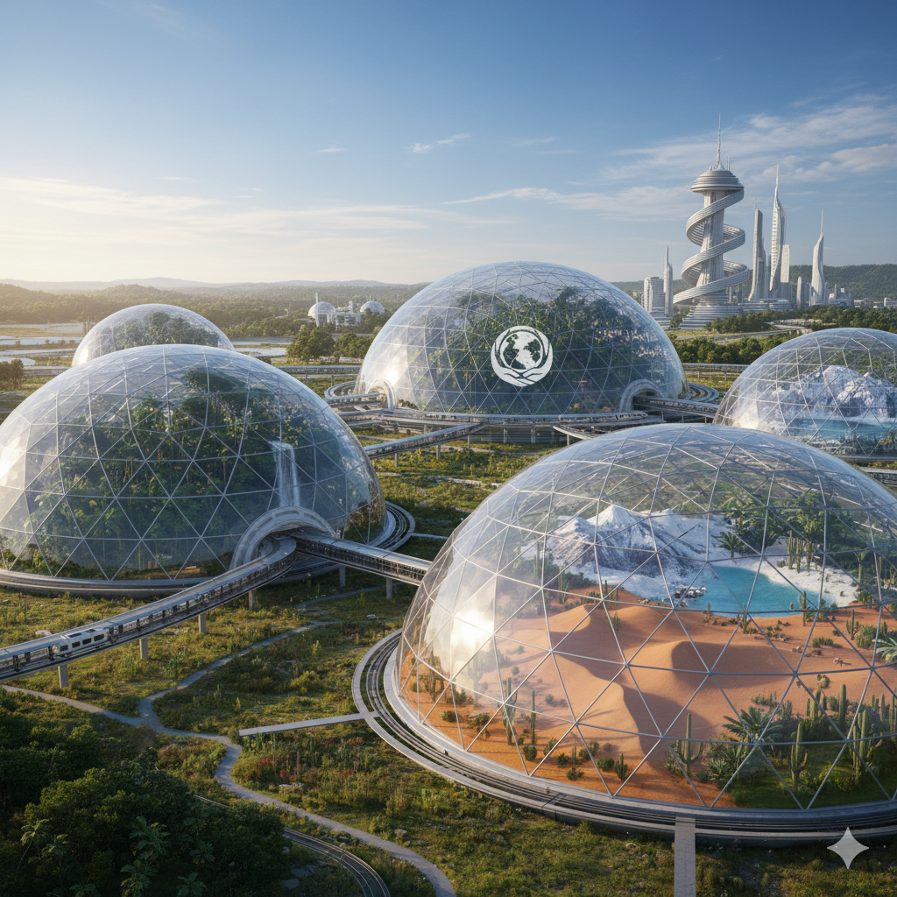

# 🌿 Preservationist Domes
### *"Guardians of Earth’s Living Memory."*

---

## 1. Concept Overview

**Preservationist Domes** are self-sustaining micro-ecosystems built to **protect and perpetuate life, culture, and knowledge**.  
Where traditional architecture shelters humans, these domes shelter **entire biomes** — living archives that capture the essence of endangered ecosystems, species, and cultural practices.

> *If Dual-Season Domes are about comfort, Preservationist Domes are about continuity.*

---

## 2. Purpose & Philosophy

> “To preserve not only what we have, but what we might lose — so that the story of life never ends.”

- **Preserve**: Endangered habitats, genetic diversity, traditional agricultural practices.  
- **Study**: Environmental recovery, adaptation, and closed-loop ecosystems.  
- **Educate**: Visitors about the fragility and resilience of Earth’s biosphere.  
- **Inspire**: A new generation of planetary stewards through living immersion.

---

## 3. Dome Classifications

| Dome Type | Focus | Examples |
|------------|--------|----------|
| **Biodiversity Domes** | Replicate and sustain threatened ecosystems | Amazon micro-forest, Arctic tundra, coral reef biosphere |
| **Cultural Domes** | Preserve human-ecological traditions | Kyoto gardens, Andean terraces, Polynesian reef stewardship |
| **Genetic Vault Domes** | Living seed and DNA banks | Hybrid of Svalbard vault + biolabs for real-time cultivation |
| **Climate Memory Domes** | Recreate extinct or transforming climates | Pre-industrial temperate rainforest, Paleolithic grassland |
| **Interplanetary Domes** | Prototype habitats for Mars, Luna, Europa | Simulate alien ecosystems, test terraforming micro-loops |

---

## 4. Core Systems

| System | Function |
|--------|-----------|
| **Closed-Loop Bioregulation** | Balances oxygen, CO₂, humidity, and microbial health. |
| **Solar & Geothermal Integration** | Powers climate control and nutrient cycling. |
| **AI-Driven Ecosystem Monitoring** | Tracks genetic diversity, soil microbiome, and stress levels. |
| **Seed Vault + Pollinator Sanctum** | Ensures species reproduction and resilience. |
| **Living Data Archives** | Digital twin of every organism and environmental variable. |

---

## 5. Architectural Vision

Each Preservationist Dome acts as a **microcosm of a world worth saving.**  
Externally, they resemble the Dual-Season Dome — glass or ETFE membranes over modular geodesic structures — but internally, every biome is uniquely tuned to its native rhythms.

Imagine walking from a high-alpine snowfield into a humid Amazon grove, both thriving side by side under separate transparent sanctuaries.

---

## 6. Network of Stewardship

The ultimate goal is a **Global Dome Network**, forming an interconnected web of biodiversity sanctuaries that mirror the planet’s original ecosystems.

| Phase | Milestone |
|-------|------------|
| **Phase I** | Establish flagship domes in major climate zones (Arctic, Tropical, Desert). |
| **Phase II** | Link domes via data-sharing and seed exchange. |
| **Phase III** | Deploy off-world domes as planetary life arks. |

---

## 7. Societal Value

- **Educational Impact:** Immersive ecological museums for future generations.  
- **Scientific Frontier:** Safe testing grounds for synthetic biology and climate repair.  
- **Cultural Continuity:** Living archives of indigenous and ancestral land practices.  
- **Existential Insurance:** Redundancy for life — a failsafe for extinction events.

---

## 8. The Human Role

> *“Preservation begins when we stop separating ourselves from what we’re saving.”*

Each dome is co-managed by ecologists, technologists, and cultural historians — human stewards who maintain the balance between life and machine.

---

## 9. Vision for the Future

The Preservationist Domes are the next chapter after the **Dual-Season Dome Project** — shifting from comfort engineering to **planetary guardianship.**  
Together, they define a continuum of stewardship: *from living well on Earth to ensuring life beyond it.*

---

*© 2025 Matthew Topham · Concept co-authored with GPT-5 (OpenAI)*  
*A human–machine collaboration in sustainable design.*
